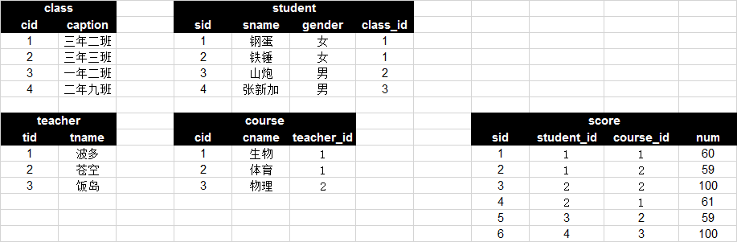

# day27 SQL强化和实践 自己做


课程目标：练习常见的SQL语句和表结构的设计。

课程概要：

- SQL强化
- 表结构设计（博客系统）


## 1. SQL强化


1. 根据上图创建  数据库 & 表结构 并 录入数据（可以自行创造数据）。

   - 答案

     ```sql
     create database day27db default charset utf8 collate utf8_general_ci;
     use day27db;
     
     drop database day27db;
     drop database IF EXISTS day27db;
     
     -- 利用导入数据库命令：
     -- 导入
     mysql -u root -p  day27db < /Users/wupeiqi/day27db.sql
     -- 导出
     # 结构+数据
     mysqldump -u root -p  day27db > /Users/wupeiqi/day27db2.sql
     
     # 结构
     mysqldump -u root -p -d day27db > /Users/wupeiqi/day27db3.sql
     ```

     

   - 创建数据库(文件夹)

   ```sql
   create database day27db DEFAULT CHARSET utf8 COLLATE utf8_general_ci;
   ```

   - 创建表和数据

     ```sql
     -- class表
     create table class(
     cid int not null auto_increment primary key,
     caption varchar(16) not null
     )default charset=utf8;
     -- class表数据
     insert into class (cid,caption) values('1', '三年二班'), ('2', '三年三班'), ('3', '一年二班'), ('4', '二年九班');
     
     -- student表
     create table student(
     sid int not null auto_increment primary key,
     sname varchar(16) not null,
     gender varchar(16) not null,
     class_id int not null,
     constraint fk_student_class foreign key (class_id) references class(cid)
     )default charset=utf8;
     -- student表 数据
     insert into student (sid,sname,gender,class_id) values('1','钢蛋','女','1'),('2','铁锤','女','1'),('3','山炮','男','2');
     
     -- teacher表
     create table teacher(
     tid int not null auto_increment primary key,
     tname varchar(16) not null
     )default charset=utf8;
     -- teacher表数据
     insert into teacher (tid,tname) values ('1','波多'),('2','苍空'),('3','饭岛');
     
     -- course表
     create table course(
     cid int not null auto_increment primary key,
     cname varchar(16) not null,
     teacher_id int not null,
     constraint fk_course_teacher foreign key (teacher_id) references teacher(tid)
     )default charset=utf8;
     -- course表数据
     insert into course (cid,cname,teacher_id) values ('1','生物','1'),('2','体育','1'),('3','物理','2');
     
     -- score表
     create table score(
     sid int not null auto_increment primary key,
     student_id int not null,
     course_id int not null,
     num int not null,
     constraint fk_score_student foreign key (student_id) references student(sid),
     constraint fk_score_course foreign key (course_id) references course(cid)
     )default charset=utf8;
     -- score表数据
     insert into score (sid,student_id,course_id,num) values ('1','1','1','60'),('2','1','2','59'),('3','2','2','100');
     insert into score (student_id,course_id,num) values ('2','1','61'),('3','2','59'),('4','3','100');
     ```

2. 创建用户 luffy 并赋予此数据库的所有权限。

   ```sql
   create user 'luffy'@'%' identified by '123';
   grant all privileges on day27db.* to 'luffy'@'%';
   flush privileges;
   ```

   

3. 查询姓“李”的老师的个数。

   ```sql
   select * from teacher where tname like "李%";
   
   -- 结果为0
   ```

   

4. 查询姓“张”的学生名单。

   ```sql
   -- 先插进去一个学生信息
   insert into student (sname,gender,class_id) values('张新加','男','3');
   -- 查询张姓同学个数
   select * from student where sname like "张%";
   -- 结果为1
   +-----+--------+--------+----------+ 
   | sid | sname  | gender | class_id | 
   +-----+--------+--------+----------+ 
   |   4 | 张新加  | 男      |       3 | 
   +-----+--------+--------+----------+ 
   ```

   

5. 查询男生、女生的人数。

   ```sql
   select gender,count(1) from student group by gender;
   +--------+----------+
   | gender | count(1) |
   +--------+----------+
   | 女     |        2 |
   | 男     |        2 |
   +--------+----------+
   ```

   

6. 查询同名同姓学生名单，并统计同名人数。

   ```sql
   select sname,count(1) from student group by sname;
   -- 结果
   +--------+----------+
   | sname  | count(1) |
   +--------+----------+
   | 山炮   |        1 |
   | 张新加 |        1 |
   | 钢蛋   |        1 |
   | 铁锤   |        1 |
   +--------+----------+
   
   select sname,count(1) from student group by sname having count(1) > 1;
   -- 结果 Empty set (0.11 sec)
   ```

   

7. 查询 “三年二班” 的所有学生。

   ```sql
   select * from student left join class on student.class_id = class.cid where class.caption = "三年二班"; 
   -- 结果
   +-----+-------+--------+----------+------+----------+
   | sid | sname | gender | class_id | cid  | caption  |
   +-----+-------+--------+----------+------+----------+
   |   1 | 钢蛋  | 女     |        1 |    1 | 三年二班 |
   |   2 | 铁锤  | 女     |        1 |    1 | 三年二班 |
   +-----+-------+--------+----------+------+----------+
   ```

   

8. 查询 每个 班级的 班级名称、班级人数。

   ```sql
   select class_id,count(1)  from student group by class_id;
   +----------+----------+
   | class_id | count(1) |
   +----------+----------+
   |        1 |        2 |
   |        2 |        1 |
   |        3 |        1 |
   +----------+----------+
   
   select class.caption,count(1) from student left join class on student.class_id = class.cid group by class.caption;
   +----------+----------+
   | caption  | count(1) |
   +----------+----------+
   | 一年二班 |        1 |
   | 三年三班 |        1 |
   | 三年二班 |        2 |
   +----------+----------+
   ```

   

9. 查询成绩小于60分的同学的学号、姓名、成绩、课程名称。

   ```sql
   select * from score where num <60;
   +-----+------------+-----------+-----+
   | sid | student_id | course_id | num |
   +-----+------------+-----------+-----+
   |   2 |          1 |         2 |  59 |
   +-----+------------+-----------+-----+
   
   select
   	student.sid,
   	student.sname,
   	score.num,
   	course.cname
   from
   	score
   	left join student on score.student_id=student.sid
   	left join course on score.course_id=course.cid
   where num <60;
   +------+-------+-----+-------+
   | sid  | sname | num | cname |
   +------+-------+-----+-------+
   |    1 | 钢蛋  |  59 | 体育  |
   +------+-------+-----+-------+
   ```

   

10. 查询选修了 “生物课” 的所有学生ID、学生姓名、成绩。

    ```sql
    select * from score left join course on score.course_id=course.cid where course.cname='生物';
    +-----+------------+-----------+-----+------+-------+------------+
    | sid | student_id | course_id | num | cid  | cname | teacher_id |
    +-----+------------+-----------+-----+------+-------+------------+
    |   1 |          1 |         1 |  60 |    1 | 生物  |          1 |
    +-----+------------+-----------+-----+------+-------+------------+
    
    select
    	student.sid,
    	student.sname,
    	score.num
    from
    	score
    	left join course on score.course_id=course.cid
    	left join student on score.student_id=student.sid
    where course.cname='生物';
    +------+-------+-----+
    | sid  | sname | num |
    +------+-------+-----+
    |    1 | 钢蛋  |  60 |
    +------+-------+-----+
    ```

    

11. 查询选修了 “生物课” 且分数低于60的的所有学生ID、学生姓名、成绩。

    ```sql
    select
    	student.sid,
    	student.sname,
    	score.num
    from
    	score
    	left join student on score.student_id=student.sid
    	left join course on score.course_id=course.cid
    where course.cname='生物' and score.num < 60;
    
    --结果
    Empty set (0.00 sec)
    ```

    

12. 查询所有同学的学号、姓名、选课数、总成绩。

    ```sql
    select student_id,count(1),sum(num) from score group by student_id;
    +------------+----------+----------+
    | student_id | count(1) | sum(num) |
    +------------+----------+----------+
    |          1 |        2 |      119 |
    |          2 |        1 |      100 |
    +------------+----------+----------+
    
    select
    	student.sid,
    	student.sname,
    	count(1),
    	sum(num)
    from 
    	score
    	left join student on score.student_id=student.sid
    	group by student_id;
    +------+-------+----------+----------+
    | sid  | sname | count(1) | sum(num) |
    +------+-------+----------+----------+
    |    1 | 钢蛋  |        2 |      119 |
    |    2 | 铁锤  |        1 |      100 |
    +------+-------+----------+----------+
    ```

    

13. 查询各科被选修的学生数。

    ```sql
    select course_id,count(1) from score group by course_id;
    +-----------+----------+
    | course_id | count(1) |
    +-----------+----------+
    |         1 |        1 |
    |         2 |        2 |
    +-----------+----------+
    
    select
    	course_id,
    	course.cname,
    	count(1)
    from
    	score
    	left join course on score.course_id=course.cid
    group by course_id;
    +-----------+-------+----------+
    | course_id | cname | count(1) |
    +-----------+-------+----------+
    |         1 | 生物  |        1 |
    |         2 | 体育  |        2 |
    +-----------+-------+----------+
    ```

    

14. 查询各科成绩的总分、最高分、最低分，显示：课程ID、课程名称、总分、最高分、最低分。

    ```sql
    select 
    	course_id,
    	course.cname,
    	sum(num),
    	max(num),
    	min(num)
    from
    	score
    	left join course on score.course_id=course.cid
    group by course_id;
    +-----------+-------+----------+----------+----------+
    | course_id | cname | sum(num) | max(num) | min(num) |
    +-----------+-------+----------+----------+----------+
    |         1 | 生物  |       60 |       60 |       60 |
    |         2 | 体育  |      159 |      100 |       59 |
    +-----------+-------+----------+----------+----------+
    ```

    

15. 查询各科成绩的平均分，显示：课程ID、课程名称、平均分。

    ```sql
    select 
    	course_id,
    	course.cname,
    	avg(num)
    from
    	score
    	left join course on score.course_id=course.cid
    group by course_id;
    +-----------+-------+----------+
    | course_id | cname | avg(num) |
    +-----------+-------+----------+
    |         1 | 生物  |  60.0000 |
    |         2 | 体育  |  79.5000 |
    +-----------+-------+----------+
    ```

    

16. 查询各科成绩的平均分，显示：课程ID、课程名称、平均分（按平均分从大到小排序）。

    ```sql
    select
    	course_id,
    	course.cname,
    	avg(num)
    from
    	score
    	left join course on score.course_id=course.cid
    group by course_id
    order by avg(num) desc;
    
    +-----------+-------+----------+
    | course_id | cname | avg(num) |
    +-----------+-------+----------+
    |         2 | 体育  |  79.5000 |
    |         1 | 生物  |  60.0000 |
    +-----------+-------+----------+
    ```

    

17. **查询各科成绩的平均分和及格率，显示：课程ID、课程名称、平均分、及格率**。

    ```sql
    select 
    	course_id,
    	course.cname,
    	avg(num),
    	sum(case when score.num > 60 then 1 else 0 end)/count(1) *100 as percent 
    from 
    	score 
    	left join course on score.course_id =course.cid 
    group by 
    	course_id;
    
    +-----------+-------+----------+---------+
    | course_id | cname | avg(num) | percent |
    +-----------+-------+----------+---------+
    |         1 | 生物  |  60.0000 |  0.0000 |
    |         2 | 体育  |  79.5000 | 50.0000 |
    +-----------+-------+----------+---------+
    ```

    

18. 查询平均成绩大于60的所有学生的学号、平均成绩；。

    ```sql
    select
    	student_id,
    	avg(num)
    from score
    group by student_id
    having avg(num) > 60;
    
    +------------+----------+
    | student_id | avg(num) |
    +------------+----------+
    |          2 | 100.0000 |
    +------------+----------+
    ```

19. 查询平均成绩大于85的所有学生的学号、平均成绩、姓名。

    ```sql
    select
    	student_id,
    	avg(num),
    	student.sname
    from
    	score
    	left join student on score.student_id=student.sid
    group by student_id having avg(num) > 85;
    +------------+----------+-------+
    | student_id | avg(num) | sname |
    +------------+----------+-------+
    |          2 | 100.0000 | 铁锤  |
    +------------+----------+-------+
    ```

    

20. 查询 “三年二班”  每个学生的 学号、姓名、总成绩、平均成绩。

    ```sql
    select
    	student_id,
    	student.sname,
    	sum(num),
    	avg(num)
    from
    	score
    	left join student on score.student_id=student.sid
    	left join class on class.cid=student.class_id
    where class.caption = "三年二班"
    group by student_id;
    +------------+-------+----------+----------+
    | student_id | sname | sum(num) | avg(num) |
    +------------+-------+----------+----------+
    |          1 | 钢蛋  |      119 |  59.5000 |
    |          2 | 铁锤  |      100 | 100.0000 |
    +------------+-------+----------+----------+
    ```

    

21. 查询各个班级的班级名称、总成绩、平均成绩、及格率（按平均成绩从大到小排序）。

    ```sql
    select 
    	class.cid,
    	class.caption,
    	sum(num),
    	avg(num),
    	sum(case when score.num > 60 then 1 else 0 end)/count(1) *100 as percent 
    from 
    	score 
    	left join student on score.student_id =student.sid
    	left join class on class.cid=student.class_id
    group by 
    	class.cid
    order by
    	avg(num) desc;
    
    +------+----------+----------+----------+---------+
    | cid  | caption  | sum(num) | avg(num) | percent |
    +------+----------+----------+----------+---------+
    |    1 | 三年二班 |      219 |  73.0000 | 33.3333 |
    +------+----------+----------+----------+---------+
    
    -- 为了更清楚的看清楚年级,又加了一些学生分数
    insert into score (student_id,course_id,num) values ('2','1','61'),('3','2','59'),('4','3','100');
    
    +------+----------+----------+----------+----------+
    | cid  | caption  | sum(num) | avg(num) | percent  |
    +------+----------+----------+----------+----------+
    |    3 | 一年二班 |      100 | 100.0000 | 100.0000 |
    |    1 | 三年二班 |      280 |  70.0000 |  50.0000 |
    |    2 | 三年三班 |       59 |  59.0000 |   0.0000 |
    +------+----------+----------+----------+----------+
    ```

    

22. 查询学过 “波多” 老师课的同学的学号、姓名。

    ```sql
    select
    	student.sid,
    	student.sname
    from
    	score
    	left join student on score.student_id=student.sid
    	left join course on score.course_id=course.cid
    	left join teacher on course.teacher_id=teacher.tid
    where
    	teacher.tname="波多";
    +------+-------+
    | sid  | sname |
    +------+-------+
    |    1 | 钢蛋  |
    |    2 | 铁锤  |
    |    1 | 钢蛋  |
    |    2 | 铁锤  |
    |    3 | 山炮  |
    +------+-------+
    ```

    

23. 查询没学过 “波多” 老师课的同学的学号、姓名。

    ```sql
    select
    	student.sid,
    	student.sname
    from 	
    	score
    	LEFT JOIN student ON score.student_id = student.sid
    	LEFT JOIN course ON score.course_id = course.cid
    	LEFT JOIN teacher ON course.teacher_id = teacher.tid
    WHERE
    	teacher.tname != "波多";
    +------+--------+
    | sid  | sname  |
    +------+--------+
    |    4 | 张新加 |
    +------+--------+
    ```

    

24. 查询选修 “苍空” 老师所授课程的学生中，成绩最高的学生姓名及其成绩（不考虑并列）。

    ```sql
    insert into score (student_id,course_id,num) values ('3','3','50');
    -- 分割线
    select
    	student.sid,
    	student.sname
    from 	
    	score
    	LEFT JOIN student ON score.student_id = student.sid
    	LEFT JOIN course ON score.course_id = course.cid
    	LEFT JOIN teacher ON course.teacher_id = teacher.tid
    WHERE
    	teacher.tname = "苍空"
    order by
    	score.num desc
    	limit 1;
    +------+--------+
    | sid  | sname  |
    +------+--------+
    |    4 | 张新加 |
    +------+--------+
    ```

    

25. 查询选修 “苍空” 老师所授课程的学生中，成绩最高的学生姓名及其成绩（考虑并列）。!!!!

    ```sql
    insert into score (student_id,course_id,num) values ('2','3','100');
    -- 分割线
    select
    	student.sid,
    	student.sname
    from 	
    	score
    	LEFT JOIN student ON score.student_id = student.sid
    	LEFT JOIN course ON score.course_id = course.cid
    	LEFT JOIN teacher ON course.teacher_id = teacher.tid
    WHERE
    	teacher.tname = "苍空"
    	and score.num = (
            select
            	max(num)
            from
            	score
            	left join course on score.course_id=course.cid
            	left join teacher on course.teacher_id=teacher.tid
            where
            teacher.tname = '苍空');
    +------+--------+
    | sid  | sname  |
    +------+--------+
    |    4 | 张新加 |
    |    2 | 铁锤   |
    +------+--------+
    ```

    

26. 查询只选修了一门课程的全部学生的学号、姓名。

    ```sql
    select
    	student.sid,
    	student.sname
    from
    	score
    	left join student on score.student_id=student.sid
    group by
    	student_id
    having
    	count(1)=1;
    +------+--------+
    | sid  | sname  |
    +------+--------+
    |    4 | 张新加 |
    +------+--------+
    ```

    

27. 查询至少选修两门课程的学生学号、学生姓名、选修课程数量。

    ```sql
    select
    	student.sid,
    	student.sname
    from
    	score
    	left join student on score.student_id=student.sid
    group by
    	student_id
    having
    	count(1)>=2;
    +------+-------+
    | sid  | sname |
    +------+-------+
    |    1 | 钢蛋  |
    |    2 | 铁锤  |
    |    3 | 山炮  |
    +------+-------+
    ```

    

28. 查询两门及以上不及格的同学的学号、学生姓名、选修课程数量。

    ```sql
    select 
    	student.sid,
    	student.sname,
    	count(1)
    from
    	score
    	left join student on score.student_id=student.sid
    where num<60
    group by student_id
    having count(1)>2;
    -- 结果
    Empty set (0.00 sec)
    ```

    

29. 查询选修了所有课程的学生的学号、姓名。

    ```sql
    select 
    	student.sid,
    	student.sname
    from
    	score
    	left join student on score.student_id=student.sid
    group by student_id
    having count(1) = (select count(1) from course);
    +------+-------+
    | sid  | sname |
    +------+-------+
    |    2 | 铁锤  |
    +------+-------+
    ```

    

30. 查询未选修所有课程的学生的学号、姓名。

    ```sql
    select 
    	student.sid,
    	student.sname
    from
    	score
    	left join student on score.student_id=student.sid
    group by student_id
    having count(1) != (select count(1) from course);
    +------+--------+
    | sid  | sname  |
    +------+--------+
    |    1 | 钢蛋   |
    |    3 | 山炮   |
    |    4 | 张新加 |
    +------+--------+
    ```

    

31. 查询所有学生都选修了的课程的课程号、课程名。

    ```sql
    insert into score (student_id,course_id,num) values ('4','2','50');
    -- 分割线
    select
    	course_id,
    	course.cname
    from
    	score
    	left join course on score.course_id=course.cid
    group by course_id
    having count(1) = (select count(1) from student);
    +-----------+-------+
    | course_id | cname |
    +-----------+-------+
    |         2 | 体育  |
    +-----------+-------+
    ```

    

32. 查询选修 “生物” 和 “物理” 课程的所有学生学号、姓名。

    ```sql
    select
    	student.sid,
    	student.sname
    from
    	score
    	left join student on score.student_id=student.sid
    	left join course on score.course_id=course.cid
    where course.cname in ('生物','物理')
    group by student_id
    having count(1)=2;
    +------+-------+
    | sid  | sname |
    +------+-------+
    |    2 | 铁锤  |
    +------+-------+
    ```

    

33. 查询至少有一门课与学号为“1”的学生所选的课程相同的其他学生学号 和 姓名 。

    ```sql
    select
    	student.sid,
    	student.sname
    from
    	score
    	left join student on score.student_id=student.sid
    	left join course on score.course_id=course.cid
    where
    	score.course_id in (select course_id from score where student_id=1)
    	and score.student_id != 1
    group by student_id
    having count(1)>=1;
    +------+--------+
    | sid  | sname  |
    +------+--------+
    |    2 | 铁锤   |
    |    3 | 山炮   |
    |    4 | 张新加 |
    +------+--------+
    ```

    

34. 查询与学号为 “2” 的同学选修的课程完全相同的其他 学生学号 和 姓名 。???

    ```sql
    select
    	student.sid,
    	student.sname
    from
    	score
    	left join student on score.student_id=student.sid
    	left join course on score.course_id=course.cid
    where
    	score.course_id in (select course_id from score where student_id=2)
    	and score.student_id in 
    	(select student_id from score where student_id != 2 
         group by student.sid
         having count(1)=select count(1) from score where student_id=2)
    group by student_id
    having count(1) = (select count(1) from score where student_id=2);
    ```

    

35. 查询“生物”课程比“物理”课程成绩高的所有学生的学号；??

    ```sql
    select
    	student_id,
    	max(case cname when "生物" then num else 0 end) as sw,
    	max(case cname when "物理" then num else 0 end) as wl
    from
    	score
    	left join course on score.course_id=course.cid
    where
    	cname in ('生物','物理')
    group by
    	student_id
    having sw > wl;
    +------------+------+------+
    | student_id | sw   | wl   |
    +------------+------+------+
    |          1 |   60 |    0 |
    +------------+------+------+
    ```

    

36. 查询每门课程成绩最好的前3名 (不考虑成绩并列情况) 。??

    ```sql
    SELECT
    	cid,
    	cname,
    	( select student.sname from score left join student on student.sid = score.student_id where course_id = course.cid order by num desc limit 1 offset 0) as "第1名",
    	( select student.sname from score left join student on student.sid = score.student_id where course_id = course.cid order by num desc limit 1 offset 1) as "第2名",
    	( select student.sname from score left join student on student.sid = score.student_id where course_id = course.cid order by num desc limit 1 offset 2) as "第3名"
    FROM
    	course;
    +-----+-------+-------+--------+-------+
    | cid | cname | 第1名 | 第2名  | 第3名 |
    +-----+-------+-------+--------+-------+
    |   1 | 生物  | 铁锤  | 钢蛋   | NULL  |
    |   2 | 体育  | 铁锤  | 钢蛋   | 钢蛋  |
    |   3 | 物理  | 铁锤  | 张新加 | 山炮  |
    +-----+-------+-------+--------+-------+
    ```

    

37. 查询每门课程成绩最好的前3名 (考虑成绩并列情况) 。??

    ```sql
    SELECT
    	cid,
    	cname,
    	( select num from score  where course_id = course.cid GROUP BY num order by num desc limit 1 offset 0) as "最高分",
    	( select num from score  where course_id = course.cid GROUP BY num order by num desc limit 1 offset 1) as "第二高分",
    	( select num from score  where course_id = course.cid GROUP BY num order by num desc limit 1 offset 2) as "第三高分"
    FROM
    	course;
    ```

    

    ```sql
    select
    	*
    from
    	score
    	left join (
            select
            	cid,
            	cname,
            	(select num from score where course_id = course.cid group by num order by num desc limit 1 offset 0) as '最高分',
            	(select num from score where course_id = course.cid group by num order by num desc limit 1 offset 1) as '第二高分',
            	(select num from score where course_id = course.cid group by num order by num desc limit 1 offset 2) as third
            from course) as C on score.course_id=C.cid
    where
    	score.num >= C.third;
    +-----+------------+-----------+-----+------+-------+--------+----------+-------
    +
    | sid | student_id | course_id | num | cid  | cname | 最高分 | 第二高分 | third
    |
    +-----+------------+-----------+-----+------+-------+--------+----------+-------
    +
    |   2 |          1 |         2 |  59 |    2 | 体育  |    100 |       59 |    50
    |
    |   3 |          2 |         2 | 100 |    2 | 体育  |    100 |       59 |    50
    |
    |   5 |          3 |         2 |  59 |    2 | 体育  |    100 |       59 |    50
    |
    |   9 |          4 |         2 |  50 |    2 | 体育  |    100 |       59 |    50
    |
    +-----+------------+-----------+-----+------+-------+--------+----------+-------
    ```

    

38. 创建一个表 `sc`，然后将 score 表中所有数据插入到 sc 表中。

    ```sql
    CREATE TABLE `sc` (
      `sid` int NOT NULL AUTO_INCREMENT PRIMARY KEY,
      `student_id` int NOT NULL,
      `course_id` int NOT NULL,
      `num` int NOT NULL,
      CONSTRAINT `fk_sc_course` FOREIGN KEY (`course_id`) REFERENCES `course` (`cid`),
      CONSTRAINT `fk_sc_student` FOREIGN KEY (`student_id`) REFERENCES `student` (`sid`)
    ) DEFAULT CHARSET=utf8;
    
    -- 插入数据
    INSERT INTO sc SELECT * from score;
    +-----+------------+-----------+-----+
    | sid | student_id | course_id | num |
    +-----+------------+-----------+-----+
    |   1 |          1 |         1 |  60 |
    |   2 |          1 |         2 |  59 |
    |   3 |          2 |         2 | 100 |
    |   4 |          2 |         1 |  61 |
    |   5 |          3 |         2 |  59 |
    |   6 |          4 |         3 | 100 |
    |   7 |          3 |         3 |  50 |
    |   8 |          2 |         3 | 100 |
    |   9 |          4 |         2 |  50 |
    +-----+------------+-----------+-----+
    ```

    

39. 向 sc 表中插入一些记录，这些记录要求符合以下条件：
    - 学生ID为：没上过课程ID为 “2” 课程的学生的 学号；
    - 课程ID为：2
    - 成绩为：80

    ```sql
    -- 先增加一个新的学生
    insert into student (sname,gender,class_id) values ('李新加','女',4);
    
    -- 此题答案
    insert into sc (student_id,course_id,num) 
    select
        sid,
        2,
        80
    from
    	student
    where
    	sid not in (select student_id from score where course_id=2);
    +-----+------------+-----------+-----+
    | sid | student_id | course_id | num |
    +-----+------------+-----------+-----+
    |   1 |          1 |         1 |  60 |
    |   2 |          1 |         2 |  59 |
    |   3 |          2 |         2 | 100 |
    |   4 |          2 |         1 |  61 |
    |   5 |          3 |         2 |  59 |
    |   6 |          4 |         3 | 100 |
    |   7 |          3 |         3 |  50 |
    |   8 |          2 |         3 | 100 |
    |   9 |          4 |         2 |  50 |
    |  10 |          5 |         2 |  80 |
    +-----+------------+-----------+-----+
    ```

    

40. 向 sc 表中插入一些记录，这些记录要求符合以下条件：
    - 学生ID为：没上过课程ID为 “2” 课程的学生的 学号。
    - 课程ID为：2。
    - 成绩为：课程ID为3的最高分。

```sql
-- 先增加一个新的学生
insert into student (sname,gender,class_id) values ('刘新加','女',4);

-- 此题
insert into sc (student_id,course_id,num) 
select
	sid,
    2,
    (select max(num) from score where course_id=3) as num
from
	student
where
	sid not in (select student_id from score where course_id=2);
+-----+------------+-----------+-----+
| sid | student_id | course_id | num |
+-----+------------+-----------+-----+
|   1 |          1 |         1 |  60 |
|   2 |          1 |         2 |  59 |
|   3 |          2 |         2 | 100 |
|   4 |          2 |         1 |  61 |
|   5 |          3 |         2 |  59 |
|   6 |          4 |         3 | 100 |
|   7 |          3 |         3 |  50 |
|   8 |          2 |         3 | 100 |
|   9 |          4 |         2 |  50 |
|  10 |          5 |         2 |  80 |
|  11 |          5 |         2 | 100 |
|  12 |          6 |         2 | 100 |
|  13 |          7 |         2 | 100 |
+-----+------------+-----------+-----+
```


## 2. 设计表结构

根据如下的业务需求设计相应的表结构，内部需涵盖如下功能。

- 注册
- 登录
- 发布博客
- 查看博客列表，显示博客标题、创建时间、阅读数量、评论数量、赞数量等。
- 博客详细，显示博文详细、评论 等。
  - 发表评论
  - 赞 or 踩
  - 阅读数量 + 1

参考如下图片请根据如下功能来设计相应的表结构。


注意：只需要设计表结构，不需要用python代码实现具体的功能（再学一点知识点后再更好的去实现）。


### 2.1 注册和登录


### 2.2 文章列表


### 2.3 文章详细


### 2.4 评论 & 阅读 & 赞 & 踩


注意：假设都是一级评论（不能回复评论）。

博客系统 - 表结构设计


```sql
drop database blog;
drop database IF EXISTS blog;
create database blog default charset utf8 collate utf8_general_ci;
use blog;
```

```sql
-- 创建用户表
create table user(
	id int not null auto_increment primary key,
    username varchar(16) not null,
    nickname varchar(16) not null,
	mobile char(11) not null,
    password varchar(64) not null,
    email varchar(64) not null,
    ctime datetime not null
)default charset=utf8;

-- 创建文章表
create table article(
	id int not null auto_increment primary key,
    title varchar(255) not null,
    text text not null,
	read_count int default 0,
	comment_count int default 0,
	up_count int default 0,
	down_count int default 0,
    user_id int not null,
    ctime datetime not null,
    constraint fk_article_user foreign key (user_id) references user(id)
)default charset=utf8;

-- 创建评论表
create table comment(
    id int not null auto_increment primary key,
    content varchar(255) not null,
    user_id int not null,
	article_id int not null,
    ctime datetime not null,
    constraint fk_comment_user foreign key (user_id) references user(id),
    constraint fk_comment_article foreign key (article_id) references article(id)
)default charset=utf8;

-- 创建推荐表
create table up_down(
    id int not null auto_increment primary key,
    choice tinyint not null,
    user_id int not null,
	article_id int not null,
    ctime datetime not null,
    constraint fk_up_down_user foreign key (user_id) references user(id),
    constraint fk_up_down_article foreign key (article_id) references article(id)
)default charset=utf8;
```


# day27 SQL强化和实践 答案


课程目标：练习常见的SQL语句和表结构的设计。

课程概要：

- SQL强化
- 表结构设计（博客系统）


## 1. SQL强化


1. 根据上图创建  数据库 & 表结构 并 录入数据（可以自行创造数据）

   ```sql
   create database day27db default charset utf8 collate utf8_general_ci;
   use day27db;
   
   drop database day27db;
   drop database IF EXISTS day27db;
   ```

   利用导入数据库命令：

   - 导入

     ```
     mysql -u root -p  day27db < /Users/wupeiqi/day27db.sql
     ```

   - 导出

     ```
     # 结构+数据
     mysqldump -u root -p  day27db > /Users/wupeiqi/day27db2.sql
     
     # 结构
     mysqldump -u root -p -d day27db > /Users/wupeiqi/day27db3.sql
     ```

   ```sql
   create table class(
   	cid int not null auto_increment primary key,
       caption varchar(16) not null
   )default charset=utf8;
   
   INSERT INTO class VALUES ('1', '三年二班'), ('2', '三年三班'), ('3', '一年二班'), ('4', '二年九班');
   
   
   create table student(
   	 sid int not null auto_increment primary key,
       gender char(1) not null,
       class_id int not null,
       sname varchar(16) not null,
       constraint fk_student_class foreign key (class_id) references class(cid)
   )default charset=utf8;
   
   INSERT INTO student VALUES ('1', '男', '1', '理解'), ('2', '女', '1', '钢蛋'), ('3', '男', '1', '张三'), ('4', '男', '1', '张一'), ('5', '女', '1', '张二'), ('6', '男', '1', '张四'), ('7', '女', '2', '铁锤'), ('8', '男', '2', '李三'), ('9', '男', '2', '李一'), ('10', '女', '2', '李二'), ('11', '男', '2', '李四'), ('12', '女', '3', '如花'), ('13', '男', '3', '刘三'), ('14', '男', '3', '刘一'), ('15', '女', '3', '刘二'), ('16', '男', '3', '刘四');
   
   
   create table teacher(
   	 tid int not null auto_increment primary key,
       tname varchar(16) not null
   )default charset=utf8;
   
   INSERT INTO `teacher` VALUES ('1', '张磊老师'), ('2', '李平老师'), ('3', '刘海燕老师'), ('4', '朱云海老师'), ('5', '李杰老师');
   
   
   create table course(
   	   cid int not null auto_increment primary key,
       cname varchar(16) not null,
       teacher_id int not null,
       constraint fk_course_teacher foreign key (teacher_id) references teacher(tid)
   )default charset=utf8;
   
   INSERT INTO `course` VALUES ('1', '生物', '1'), ('2', '物理', '2'), ('3', '体育', '3'), ('4', '美术', '2');
   
   
   CREATE TABLE `score` (
     `sid` int NOT NULL AUTO_INCREMENT PRIMARY KEY,
     `student_id` int NOT NULL,
     `course_id` int NOT NULL,
     `num` int NOT NULL,
     CONSTRAINT `fk_score_course` FOREIGN KEY (`course_id`) REFERENCES `course` (`cid`),
     CONSTRAINT `fk_score_student` FOREIGN KEY (`student_id`) REFERENCES `student` (`sid`)
   ) DEFAULT CHARSET=utf8;
   
   
   INSERT INTO `score` VALUES ('1', '1', '1', '10'), ('2', '1', '2', '9'), ('5', '1', '4', '66'), ('6', '2', '1', '8'), ('8', '2', '3', '68'), ('9', '2', '4', '99'), ('10', '3', '1', '77'), ('11', '3', '2', '66'), ('12', '3', '3', '87'), ('13', '3', '4', '99'), ('14', '4', '1', '79'), ('15', '4', '2', '11'), ('16', '4', '3', '67'), ('17', '4', '4', '100'), ('18', '5', '1', '79'), ('19', '5', '2', '11'), ('20', '5', '3', '67'), ('21', '5', '4', '100'), ('22', '6', '1', '9'), ('23', '6', '2', '100'), ('24', '6', '3', '67'), ('25', '6', '4', '100'), ('26', '7', '1', '9'), ('27', '7', '2', '100'), ('28', '7', '3', '67'), ('29', '7', '4', '88'), ('30', '8', '1', '9'), ('31', '8', '2', '100'), ('32', '8', '3', '67'), ('33', '8', '4', '88'), ('34', '9', '1', '91'), ('35', '9', '2', '88'), ('36', '9', '3', '67'), ('37', '9', '4', '22'), ('38', '10', '1', '90'), ('39', '10', '2', '77'), ('40', '10', '3', '43'), ('41', '10', '4', '87'), ('42', '11', '1', '90'), ('43', '11', '2', '77'), ('44', '11', '3', '43'), ('45', '11', '4', '87'), ('46', '12', '1', '90'), ('47', '12', '2', '77'), ('48', '12', '3', '43'), ('49', '12', '4', '87'), ('52', '13', '3', '87');
   ```

2. 创建用户 luffy 并赋予此数据库的所有权限。

   ```sql
   create user 'luffy'@'%' identified by 'root123';
   grant all privileges on day27db.* TO 'luffy'@'%';
   flush privileges;
   ```

3. 查询姓“李”的老师的个数。

   ```sql
   select * from teacher where tname like "李%";
   ```

4. 查询姓“张”的学生名单。

   ```sql
   select * from student where sname like "张%";
   ```

5. 查询男生、女生的人数。

   ```sql
   select gender,count(1) from student group by gender;
   ```

6. 查询同名同姓学生名单，并统计同名人数。

   ```sql
   select sname,count(1) from student group by sname;
   select sname,count(1) from student group by sname having count(1) > 1;
   ```

7. 查询 “三年二班” 的所有学生。

   ```sql
   select * from student left join class on student.class_id = class.cid where class.caption="三年二班";
   ```

8. 查询 每个 班级的 班级名称、班级人数。

   ```sql
   select class_id,count(1) from student group by class_id;
   
   select class.caption,count(1) from student left join class on student.class_id = class.cid group by class.caption;
   ```

9. 查询成绩小于60分的同学的学号、姓名、成绩、课程名称。

   ```sql
   select * from score where num <60;
   
   select 
   	student.sid,
   	student.sname,
   	score.num,
   	course.cname 
   from 
   	score 
   	left join student on score.student_id=student.sid 
   	left join course on score.course_id =course.cid 
   where num <60;
   ```

10. 查询选修了 “生物课” 的所有学生ID、学生姓名、成绩。

    ```sql
    select * from score left join course on score.course_id =course.cid where course.cname="生物";
    
    
    select 
    	student.sid,
    	student.sname,
    	score.num 
    from 
    	score 
    	left join course on score.course_id =course.cid 
    	left join student on score.student_id=student.sid 
    where course.cname="生物";
    ```

11. 查询选修了 “生物课” 且分数低于60的的所有学生ID、学生姓名、成绩。

    ```sql
    select
    	student.sid,
    	student.sname,
    	score.num 
    from 
    	score 
    	left join course on score.course_id =course.cid 
    	left join student on score.student_id=student.sid 
    where course.cname="生物" and score.num < 60;
    ```

    

12. 查询所有同学的学号、姓名、选课数、总成绩。

    ```sql
    select student_id,count(1),sum(num) from score group by student_id;
    
    select student_id,student.sname,count(1),sum(num) from score left join student on score.student_id=student.sid group by student_id;
    ```

13. 查询各科被选修的学生数。

    ```sql
    select course_id,count(1) from score group by course_id;
    
    select course_id,course.cname,count(1) from score left join course on score.course_id =course.cid group by course_id;
    ```

14. 查询各科成绩的总分、最高分、最低分，显示：课程ID、课程名称、总分、最高分、最低分。

    ```sql
    select course_id,course.cname,sum(num), max(num), min(num) from score left join course on score.course_id =course.cid group by course_id;
    ```

15. 查询各科成绩的平均分，显示：课程ID、课程名称、平均分。

    ```sql
    select course_id,course.cname,avg(num) from score left join course on score.course_id =course.cid group by course_id;
    ```

16. 查询各科成绩的平均分，显示：课程ID、课程名称、平均分（按平均分从大到小排序）。

    ```sql
    select course_id,course.cname,avg(num) from score left join course on score.course_id =course.cid group by course_id order by avg(num) desc;
    
    
    select course_id,course.cname,avg(num) as A from score left join course on score.course_id =course.cid group by course_id order by A desc;
    ```

17. 查询各科成绩的平均分和及格率，显示：课程ID、课程名称、平均分、及格率。

    ```
    10/20 = 及格率 及格人数/总人数=及格率
    
    select course_id,count(1) from score group by course_id;
    ```

    ```sql
    select 
    	sid,
    	course_id,
    	num,
    	case when score.num >= 60 then 1 else 0 end "是否及格" 
    from score;
    ```

    ```sql
    select sid,course_id,num,case when score.num > 60 then 1 else 0 end "是否及格" from score;
    ```

    ```sql
    select 
    	course_id,
    	course.cname,
    	avg(num),
    	count(1) as total,
    	sum(case when score.num > 60 then 1 else 0 end) 
    from 
    	score 
    	left join course on score.course_id =course.cid 
    group by 
    	course_id;
    ```

    ```sql
    select 
    	course_id,
    	course.cname,
    	avg(num),
    	sum(case when score.num > 60 then 1 else 0 end)/count(1) *100 as percent 
    from 
    	score 
    	left join course on score.course_id =course.cid 
    group by 
    	course_id;
    ```

    

18. 查询平均成绩大于60的所有学生的学号、平均成绩；

    ```sql
    select student_id,avg(num) from score group by student_id having avg(num) > 60;
    ```

19. 查询平均成绩大于85的所有学生的学号、平均成绩、姓名。

    ```sql
    select student_id,avg(num) from score group by student_id having avg(num) > 85;
    
    select student_id,avg(num),student.sname from score left join student on score.student_id=student.sid   group by student_id having avg(num) > 85;
    ```

20. 查询 “三年二班”  每个学生的 学号、姓名、总成绩、平均成绩。

    ```sql
    SELECT
    	* 
    FROM
    	score
    	LEFT JOIN student ON score.student_id = student.sid
    	LEFT JOIN class ON class.cid = student.class_id;
    ```

    ```sql
    SELECT
    	* 
    FROM
    	score
    	LEFT JOIN student ON score.student_id = student.sid
    	LEFT JOIN class ON class.cid = student.class_id 
    WHERE
    	class.caption = "三年二班";
    ```

    ```sql
    SELECT
    	student_id,
    	sname,
    	sum( num ),
    	avg( num ) 
    FROM
    	score
    	LEFT JOIN student ON score.student_id = student.sid
    	LEFT JOIN class ON class.cid = student.class_id 
    WHERE
    	class.caption = "三年二班" 
    GROUP BY
    	student_id
    ```

21. 查询各个班级的班级名称、总成绩、平均成绩、及格率（按平均成绩从大到小排序）。

    ```sql
    SELECT
    	class.cid,
    	class.caption,
    	sum( num ),
    	avg( num ) as av,
    	sum( CASE WHEN score.num > 60 THEN 1 ELSE 0 END ) / count( 1 ) * 100 as JG
    FROM
    	score
    	LEFT JOIN student ON score.student_id = student.sid
    	LEFT JOIN class ON class.cid = student.class_id 
    GROUP BY
    	class.cid
    ORDER BY
    	av desc
    	
    ```

22. 查询学过 “波多” 老师课的同学的学号、姓名。

    ```sql
    SELECT
    	student.sid,
    	student.sname
    FROM
    	score
    	LEFT JOIN student ON score.student_id = student.sid
    	LEFT JOIN course ON score.course_id = course.cid
    	LEFT JOIN teacher ON course.teacher_id = teacher.tid
    WHERE
    	teacher.tname = "波多" 
    ```

23. 查询没学过 “波多” 老师课的同学的学号、姓名。

    ```sql
    SELECT
    	student.sid,
    	student.sname
    FROM
    	score
    	LEFT JOIN student ON score.student_id = student.sid
    	LEFT JOIN course ON score.course_id = course.cid
    	LEFT JOIN teacher ON course.teacher_id = teacher.tid
    WHERE
    	teacher.tname != "波多" 
    ```

    ```sql
    select * from student where sid not in(
        SELECT
            student.sid
        FROM
            score
            LEFT JOIN student ON score.student_id = student.sid
            LEFT JOIN course ON score.course_id = course.cid
            LEFT JOIN teacher ON course.teacher_id = teacher.tid
        WHERE
            teacher.tname = "波多" 
    )
    ```

24. 查询选修 “苍空” 老师所授课程的学生中，成绩最高的学生姓名及其成绩（不考虑并列）。

    ```sql
    SELECT
    	student.sid,
    	student.sname 
    FROM
    	score
    	LEFT JOIN student ON score.student_id = student.sid
    	LEFT JOIN course ON score.course_id = course.cid
    	LEFT JOIN teacher ON course.teacher_id = teacher.tid 
    WHERE
    	teacher.tname = "苍空" 
    ORDER BY
    	score.num DESC 
    	LIMIT 1
    ```

25. 查询选修 “苍空” 老师所授课程的学生中，成绩最高的学生姓名及其成绩（考虑并列）。

    ```sql
    SELECT
    	student.sid,
    	student.sname 
    FROM
    	score
    	LEFT JOIN student ON score.student_id = student.sid
    	LEFT JOIN course ON score.course_id = course.cid
    	LEFT JOIN teacher ON course.teacher_id = teacher.tid 
    WHERE
    	teacher.tname = "苍空" 
    	AND score.num = (
            SELECT
                max( num ) 
            FROM
                score
                LEFT JOIN course ON score.course_id = course.cid
                LEFT JOIN teacher ON course.teacher_id = teacher.tid 
            WHERE
            teacher.tname = "苍空" 
    	)
    ```

26. 查询只选修了一门课程的全部学生的学号、姓名。

    ```sql
    SELECT
    	student.sid,
    	student.sname 
    FROM
    	score
    	LEFT JOIN student ON score.student_id = student.sid 
    GROUP BY
    	student_id 
    HAVING
    	count( 1 ) =1
    ```

27. 查询至少选修两门课程的学生学号、学生姓名、选修课程数量。

    ```sql
    SELECT
    	student.sid,
    	student.sname ,
    	count(1)
    FROM
    	score
    	LEFT JOIN student ON score.student_id = student.sid 
    GROUP BY
    	student_id 
    HAVING
    	count( 1 ) >= 2
    ```

28. 查询两门及以上不及格的同学的学号、学生姓名、选修课程数量。

    ```sql
    SELECT
    	student.sid,
    	student.sname ,
    	count(1)
    FROM
    	score
    	LEFT JOIN student ON score.student_id = student.sid 
    where 
    	num < 60
    GROUP BY
    	student_id 
    HAVING
    	count( 1 ) >= 2
    ```

29. 查询选修了所有课程的学生的学号、姓名。

    ```sql
    SELECT
    	student.sid,
    	student.sname
    FROM
    	score
    	LEFT JOIN student ON score.student_id = student.sid 
    GROUP BY
    	student_id 
    HAVING
    	count( 1 ) = ( SELECT count( 1 ) FROM course )
    ```

30. 查询未选修所有课程的学生的学号、姓名。

    ```sql
    SELECT
    	student.sid,
    	student.sname
    FROM
    	score
    	LEFT JOIN student ON score.student_id = student.sid 
    GROUP BY
    	student_id 
    HAVING
    	count( 1 ) != ( SELECT count( 1 ) FROM course )
    ```

31. 查询所有学生都选修了的课程的课程号、课程名。

    ```sql
    SELECT
    	course.cid,
    	course.cname
    FROM
    	score
    	LEFT JOIN course ON score.course_id = course.cid
    GROUP BY
    	course_id 
    HAVING
    	count( 1 ) = ( SELECT count( 1 ) FROM student )
    ```

32. 查询选修 “生物” 和 “物理” 课程的所有学生学号、姓名。

    ```sql
    SELECT
    	student.sid,
    	student.sname
    FROM
    	score
    	LEFT JOIN course ON score.course_id = course.cid
    	LEFT JOIN student ON score.student_id = student.sid
    WHERE
    	course.cname in ("生物","物理")
    GROUP BY
    	student_id
    having 
    	count(1) = 2;
    ```

33. 查询至少有一门课与学号为“1”的学生所选的课程相同的其他学生学号 和 姓名 。

    ```sql
    SELECT
    	student.sid,
    	student.sname
    FROM
    	score
    	LEFT JOIN course ON score.course_id = course.cid
    	LEFT JOIN student ON score.student_id = student.sid
    WHERE
    	score.course_id in ( select course_id from score where student_id=1)
    	and score.student_id != 1
    GROUP BY
    	student_id
    -- 如果理解为包含1,下面的不用写即可,如果认为不包含,要加一个having判断
    HAVING
    	count(1) > 1
    ```

34. 查询与学号为 “2” 的同学选修的课程完全相同的其他 学生学号 和 姓名 。

    ```sql
    SELECT
    	student.sid,
    	student.sname
    FROM
    	score
    	LEFT JOIN course ON score.course_id = course.cid
    	LEFT JOIN student ON score.student_id = student.sid
    WHERE
    	score.course_id in ( select course_id from score where student_id=2)
    	and score.student_id in (
        	select student_id from score where student_id!=2 group by student having count(1) = select count(1) from score where student_id=2
        )
    GROUP BY
    	student_id
    HAVING
    	count(1) = ( select count(1) from score where student_id=2 )
    	
    	
    # 如果id=2学生他的课程数量和其他人的课程数量是一样。
    select student_id from score where student_id!=2 group by student having count(1) = select count(1) from score where student_id=2
    
    select 
    	student_id 
    from 
    	score 
    where 
    	student_id!=2 
    group by 
    	student_id 
    having 
    	count(1) = select count(1) from score where student_id=2
    ```

35. 查询“生物”课程比“物理”课程成绩高的所有学生的学号；

    ```sql
    SELECT
    	* 
    FROM
    	score
    	LEFT JOIN course ON score.course_id = course.cid
    where 
    	cname in ("生物","物理");
    ```

    ```sql
    SELECT
    	*,
    	case cname WHEN "生物" then num else -1 end sw, -- 这是多加2列,把成绩按照列排
    	case cname WHEN "物理" then num else -1 end wl
    FROM
    	score
    	LEFT JOIN course ON score.course_id = course.cid
    where 
    	cname in ("生物","物理");
    ```

    ```sql
    SELECT
    	student_id,
    	max(case cname WHEN "生物" then num else -1 end) as sw,
    	max(case cname WHEN "物理" then num else -1 end) as wl
    FROM
    	score
    	LEFT JOIN course ON score.course_id = course.cid
    where 
    	cname in ("生物","物理")
    GROUP BY
    	student_id; -- 按照学生id分组,把学生id,生物成绩,wu
    ```

    ```sql
    SELECT
    	student_id,
    	max( CASE cname WHEN "生物" THEN num ELSE 0 END ) AS sw,
    	max( CASE cname WHEN "物理" THEN num ELSE 0 END ) AS wl 
    FROM
    	score
    	LEFT JOIN course ON score.course_id = course.cid 
    WHERE
    	cname IN ( "生物", "物理" ) 
    GROUP BY
    	student_id 
    HAVING
    	sw > wl;
    ```

36. 查询每门课程成绩最好的前3名 (不考虑成绩并列情况) 。

    ```sql
    SELECT
    	cid,
    	cname,
    	( select student.sname from score left join student on student.sid = score.student_id where course_id = course.cid order by num desc limit 1 offset 0) as "第1名",
    	( select student.sname from score left join student on student.sid = score.student_id where course_id = course.cid order by num desc limit 1 offset 1) as "第2名",
    	( select student.sname from score left join student on student.sid = score.student_id where course_id = course.cid order by num desc limit 1 offset 2) as "第3名"
    FROM
    	course;
    ```

37. 查询每门课程成绩最好的前3名 (考虑成绩并列情况) 。

    ```sql
    SELECT
    	cid,
    	cname,
    	( select num from score  where course_id = course.cid GROUP BY num order by num desc limit 1 offset 0) as "最高分",
    	( select num from score  where course_id = course.cid GROUP BY num order by num desc limit 1 offset 1) as "第二高分",
    	( select num from score  where course_id = course.cid GROUP BY num order by num desc limit 1 offset 2) as "第三高分"
    FROM
    	course;
    ```

    ```sql
    select 
    	* 
    from 
    	score 
    	
    	left join (
    		SELECT
    			cid,
    			cname,
    			( select num from score  where course_id = course.cid GROUP BY num order by num desc limit 1 offset 0) as "最高分",
    			( select num from score  where course_id = course.cid GROUP BY num order by num desc limit 1 offset 1) as "第二高分",
    			( select num from score  where course_id = course.cid GROUP BY num order by num desc limit 1 offset 2) as third
    		FROM
    			course ) as C on score.course_id = C.cid 
    WHERE
    	score.num >= C.third
    ```

38. 创建一个表 `sc`，然后将 score 表中所有数据插入到 sc 表中。

    ```sql
    CREATE TABLE `sc` (
      `sid` int NOT NULL AUTO_INCREMENT PRIMARY KEY,
      `student_id` int NOT NULL,
      `course_id` int NOT NULL,
      `num` int NOT NULL,
      CONSTRAINT `fk_sc_course` FOREIGN KEY (`course_id`) REFERENCES `course` (`cid`),
      CONSTRAINT `fk_sc_student` FOREIGN KEY (`student_id`) REFERENCES `student` (`sid`)
    ) DEFAULT CHARSET=utf8;
    ```

    ```sql
    INSERT INTO sc SELECT * from score;
    ```

39. 向 sc 表中插入一些记录，这些记录要求符合以下条件：

    - 学生ID为：没上过课程ID为 “2” 课程的学生的 学号；
    - 课程ID为：2
    - 成绩为：80

    ```sql
    -- 上过
    select student_id from score where course_id =2;
    
    -- 没上过
    SELECT
    	sid
    FROM
    	student 
    WHERE
    	sid NOT IN ( SELECT student_id FROM score WHERE course_id = 2 )
    
    
    -- 构造数据
    SELECT
    	sid,
    	2,
    	80
    FROM
    	student 
    WHERE
    	sid NOT IN ( SELECT student_id FROM score WHERE course_id = 2 );
    ```

    ```sql
    INSERT INTO sc ( student_id, course_id, num ) SELECT
    sid,
    2,
    80 
    FROM
    	student 
    WHERE
    	sid NOT IN ( SELECT student_id FROM score WHERE course_id = 2 )
    ```

40. 向 sc 表中插入一些记录，这些记录要求符合以下条件：

    - 学生ID为：没上过课程ID为 “2” 课程的学生的 学号。
    - 课程ID为：2。
    - 成绩为：课程ID为3的最高分。

    ```sql
    SELECT
    sid,
    2,
    (select max(num) from score where course_id=3) as num
    FROM
    	student 
    WHERE
    	sid NOT IN ( SELECT student_id FROM score WHERE course_id = 2 );
    ```

    

    ```sql
    INSERT INTO sc ( student_id, course_id, num ) SELECT
    sid,
    2,
    (select max(num) from score where course_id=3) as num
    FROM
    	student 
    WHERE
    	sid NOT IN ( SELECT student_id FROM score WHERE course_id = 2 )
    ```


## 2. 设计表结构

根据如下的业务需求设计相应的表结构，内部需涵盖如下功能。

- 注册
- 登录
- 发布博客
- 查看博客列表，显示博客标题、创建时间、阅读数量、评论数量、赞数量等。
- 博客详细，显示博文详细、评论 等。
  - 发表评论
  - 赞 or 踩
  - 阅读数量 + 1

参考如下图片请根据如下功能来设计相应的表结构。


注意：只需要设计表结构，不需要用python代码实现具体的功能（再学一点知识点后再更好的去实现）。


### 2.1 注册和登录


### 2.2 文章列表


### 2.3 文章详细


### 2.4 评论 & 阅读 & 赞 & 踩


注意：假设都是一级评论（不能回复评论）。


### 博客系统 - 表结构设计


```sql
drop database blog;
drop database IF EXISTS blog;
create database blog default charset utf8 collate utf8_general_ci;
use blog;
```

```sql
create table user(
	id int not null auto_increment primary key,
    username varchar(16) not null,
    nickname varchar(16) not null,
	mobile char(11) not null,
    password varchar(64) not null,
    email varchar(64) not null,
    ctime datetime not null
)default charset=utf8;


create table article(
	id int not null auto_increment primary key,
    title varchar(255) not null,
    text text not null,
	read_count int default 0,
	comment_count int default 0,
	up_count int default 0,
	down_count int default 0,
    user_id int not null,
    ctime datetime not null,
    constraint fk_article_user foreign key (user_id) references user(id)
)default charset=utf8;


create table comment(
    id int not null auto_increment primary key,
    content varchar(255) not null,
    user_id int not null,
	article_id int not null,
    ctime datetime not null,
    constraint fk_comment_user foreign key (user_id) references user(id),
    constraint fk_comment_article foreign key (article_id) references article(id)
)default charset=utf8;


create table up_down(
    id int not null auto_increment primary key,
    choice tinyint not null,
    user_id int not null,
	article_id int not null,
    ctime datetime not null,
    constraint fk_up_down_user foreign key (user_id) references user(id),
    constraint fk_up_down_article foreign key (article_id) references article(id)
)default charset=utf8;
```


